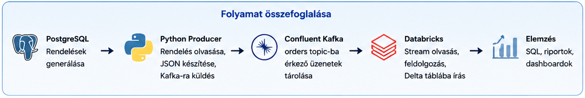
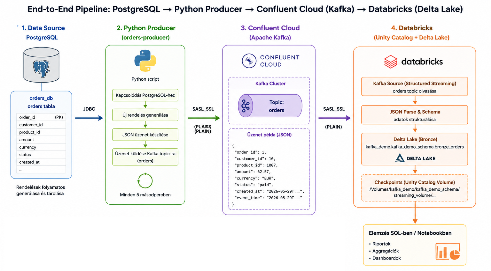

# Databricks Kafka PostgreSQL Demo

## 📌 Projekt célja

Ez a projekt egy end-to-end adatfeldolgozási pipeline bemutatása PostgreSQL, Apache Kafka és Databricks használatával.


---
## 🏗️ Rendszerarchitektúra

### Folyamat összefoglalása



### End-to-End adatfolyam



A rendszer működése:

1. **PostgreSQL**

   * Rendelési adatok tárolása
   * Orders tábla kezelése

2. **Python Producer**

   * Kapcsolódás PostgreSQL adatbázishoz JDBC segítségével
   * Új rendelések generálása
   * JSON üzenetek előállítása
   * Üzenetek küldése Kafka topicba

3. **Confluent Cloud (Apache Kafka)**

   * `orders` topic használata
   * Üzenetek fogadása és tárolása
   * SASL_SSL hitelesítés

4. **Databricks**

   * Kafka stream olvasása Structured Streaming segítségével
   * JSON adatok feldolgozása és strukturálása
   * Delta Lake Bronze tábla írása
   * Checkpoint kezelés Unity Catalog Volume használatával

5. **Analitika**

   * SQL lekérdezések
   * Aggregációk


---

## 📂 Adatforrás

A projekt rendelési adatokat dolgoz fel.

Példa mezők:

| Oszlop          | Leírás                  |
| --------------- | ----------------------- |
| order_id        | Rendelés azonosító      |
| status          | Rendelés státusza       |
| amount          | Rendelés összege        |
| kafka_timestamp | Kafka esemény időbélyeg |

---

## 📊 Aggregáció

```sql
SELECT
  status,
  COUNT(*) AS order_count,
  ROUND(SUM(amount), 2) AS total_amount
FROM kafka_demo.kafka_demo_schema.bronze_orders
GROUP BY status
ORDER BY status;
```

### Eredmény

A lekérdezés meghatározza:

* a rendelések számát státuszonként
* a rendelések összértékét

---

## 🚀 Lehetséges továbbfejlesztések

* Structured Streaming használata
* Silver és Gold rétegek kialakítása
* Delta Live Tables
* Databricks Workflows automatizálás
* Dashboard készítés Databricks SQL segítségével
* CDC integráció PostgreSQL és Kafka között
* Adatminőségi validációk

---

## 📚 Tanulási célok

A projekt gyakorlati példát mutat:

* Kafka alapú adatfeldolgozásra
* Spark SQL aggregációkra
* Databricks használatára
* PostgreSQL és Kafka integrációra

---

## 👩‍💻 Készítette

Zsuzsanna Ujvári

GitHub:
https://github.com/zsuzsi19840510
