# Kafka beállítása

## Login

https://login.confluent.io/

## 1. Environment létrehozása

A Confluent Cloudban:

**Environments → Create environment**

Név: `databricks-demo`

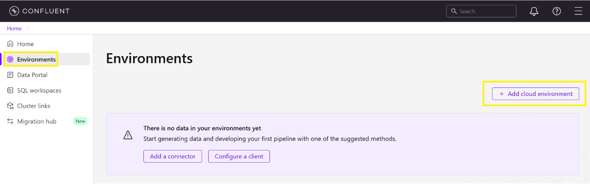

---

## 2. Kafka Cluster létrehozása

**Create cluster**

- Basic
- vagy Free Trial

Ajánlott régió: `AWS eu-central-1 (Frankfurt)`

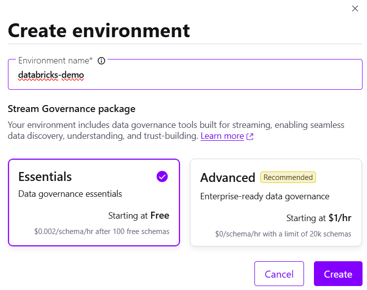

---

## 3. Topic létrehozása

**Topics → Create Topic**

Név: `orders`

Partíció: `1`

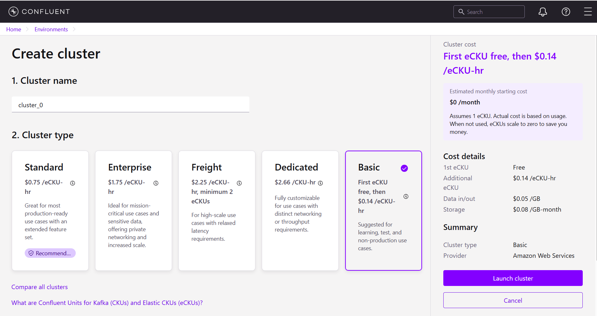
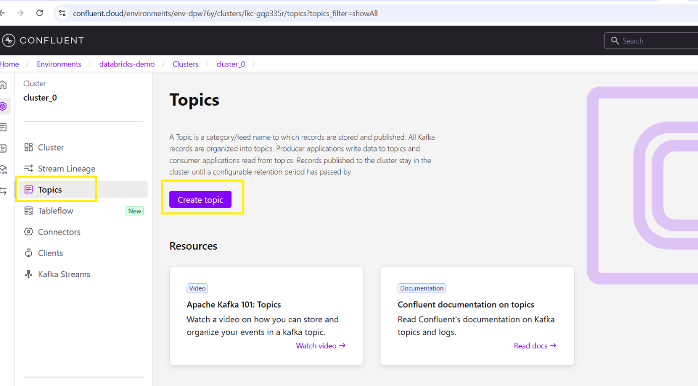

---

## 4. API Key generálása

**API Keys → Create Key**

- Global access
- vagy cluster API key

Kapott adatok:

- API_KEY
- API_SECRET

> A secretet azonnal mentsd el!

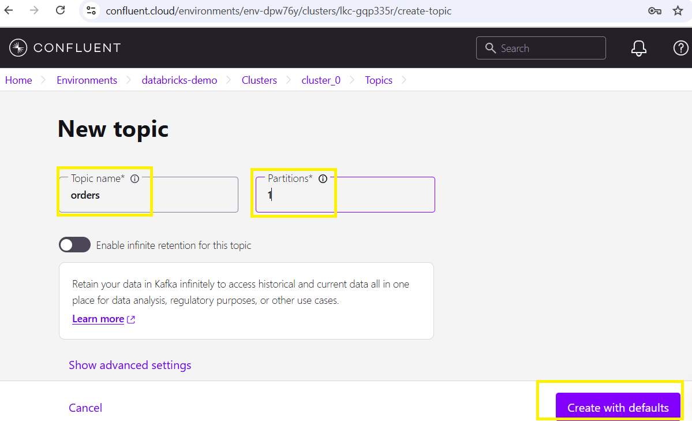
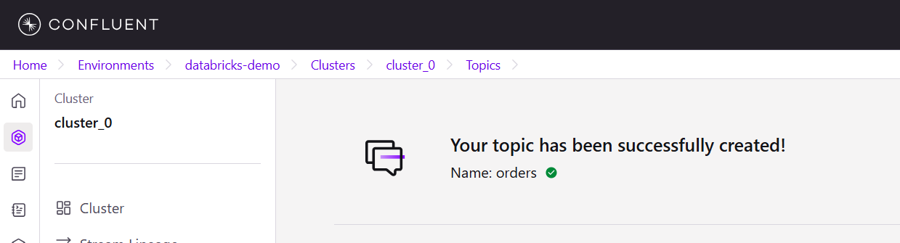
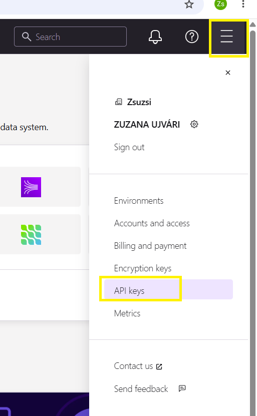
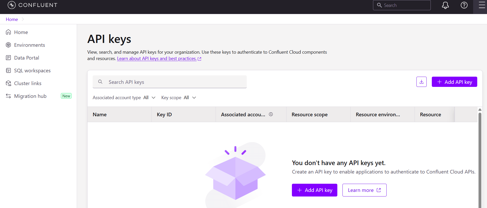

---

## 5. Bootstrap Server kimásolása

Példa:

`pkc-xxxxx.eu-central-1.aws.confluent.cloud:9092`

---

## 6. .env kitöltése

```env
CONFLUENT_BOOTSTRAP_SERVERS=...
CONFLUENT_API_KEY=...
CONFLUENT_API_SECRET=...
KAFKA_TOPIC=orders
```

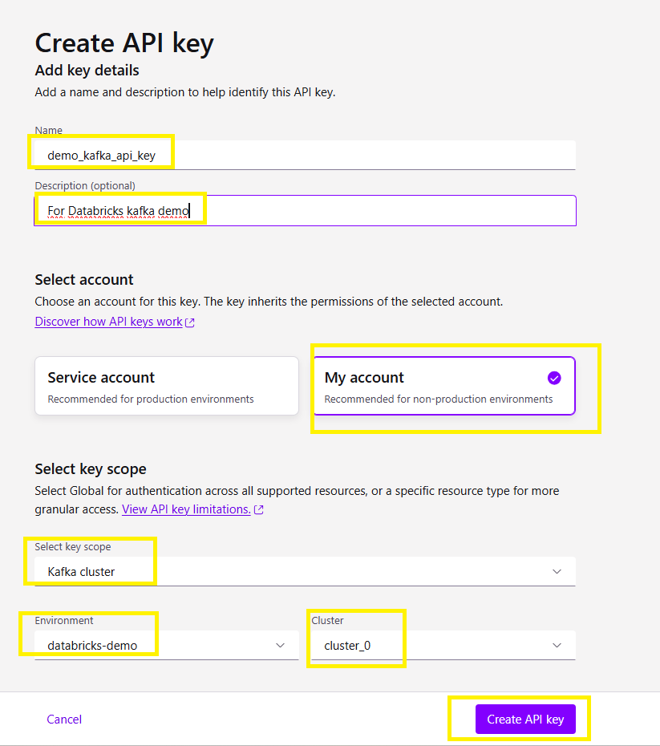

---

## 7. Docker PostgreDB indítása

```bash
docker compose up --build
```

Leállítás:

```bash
docker compose down
```

Törlés volume-okkal:

```bash
docker compose down -v
```

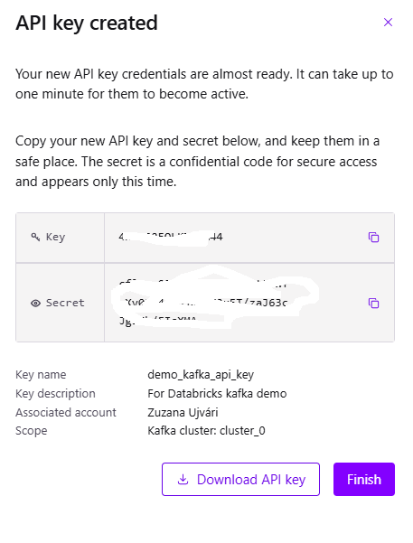

---

## 8. Ellenőrzés a Confluent UI-ban

**Topics → orders → Messages**

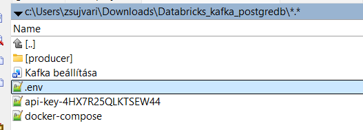
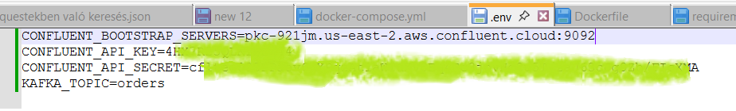
